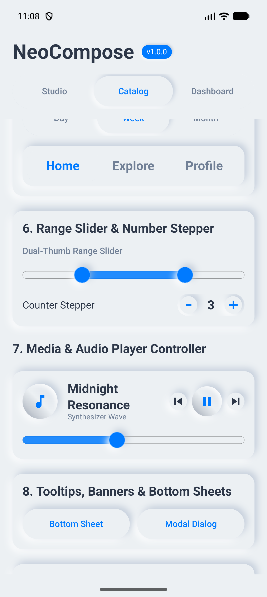
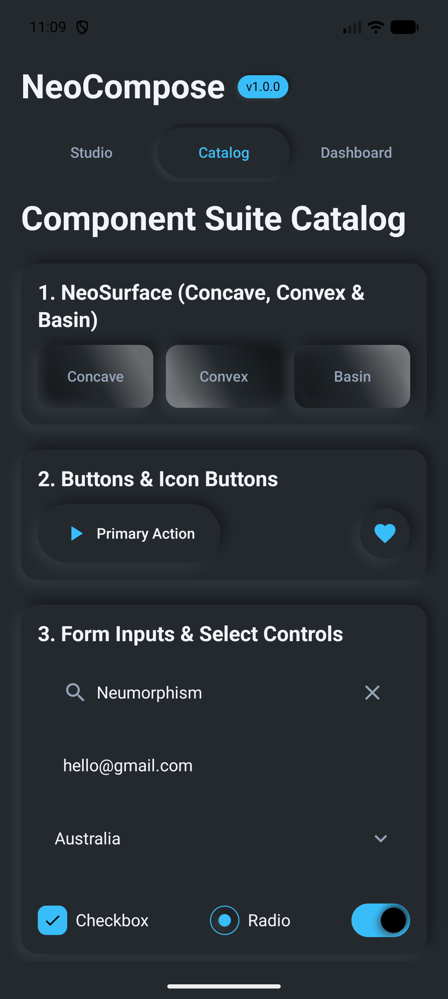
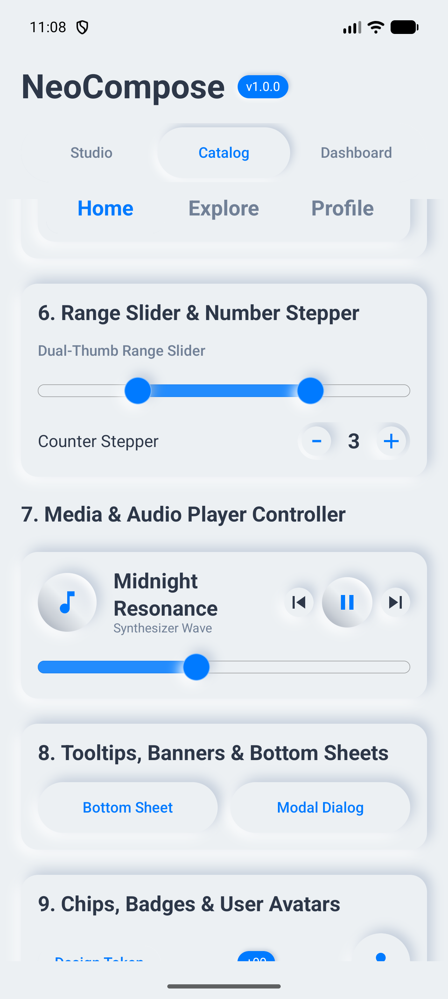
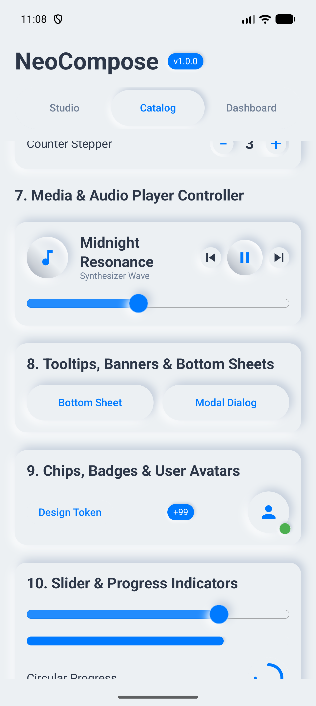

# NeoCompose (Soft UI / Neumorphism for Jetpack Compose)

[](https://search.maven.org/)
[](LICENSE)
[](https://kotlinlang.org/)
[](https://developer.android.com/jetpack/compose)

**NeoCompose** is a state-of-the-art, high-performance **Neumorphism (Soft UI)** design system library built natively for **Android & Jetpack Compose**. It provides hardware-accelerated Canvas rendering, tokenized design system architecture (`NeoTheme.size`, `NeoTheme.icons`), smooth 60fps/120fps elevation physics, and **31 production-ready components**.

---

## 📱 Live Emulator Showcase

<p neutral-align="center">
  
  
  
  
</p>

---

## 🎨 Visual Design Highlights

- **Off-White Soft Palette**: Default background `#ECF0F3`, light shadow `#FFFFFF`, dark shadow `#A3B1C6` (alpha 0.55), and Electric Blue primary accent `#007AFF`.
- **Dribbble Pill Shapes**: Standard pill shapes (`CircleShape`) for buttons, text fields, search bars, switches, and segmented controls.
- **7 Surface Styles**: `Raised`, `Pressed`, `Inset`, `Concave`, `Convex`, `Basin`, and `Flat`.
- **Directional Light Sources**: `TopLeft` (`LEFT_TOP`, 315°), `TopRight` (`RIGHT_TOP`, 45°), `BottomLeft` (`LEFT_BOTTOM`, 225°), `BottomRight` (`RIGHT_BOTTOM`, 135°), or dynamic custom angles.

---

## 🌟 Advanced Capabilities

NeoCompose is built with high-performance and modern developer demands in mind:
- **Hardware-Accelerated Shadow Caching**: Uses a thread-safe `LruCache` to pre-render blurred neumorphic shadow paths onto offscreen `ImageBitmap` buffers. Subsequent draws bypass CPU mask filters entirely, enabling smooth **120fps scrolling** in lists.
- **Interactive Specular Shaders**: Utilizes custom AGSL (Android Graphics Shading Language) fragment shaders on Android 13+ to calculate dynamic 3D specular glare highlights based on light source vectors, with a clean radial gradient fallback on older devices.
- **Sensor-Driven Dynamic Lighting**: Connects the Neumorphic light source coordinates directly to the accelerometer via `rememberSensorLightSource()`, rotating highlights and shadows smoothly as the user tilts their physical device.
- **High-Contrast Accessibility Mode**: WCAG-compliant design modes that automatically enhance shadow alphas and apply subtle `1.dp` contrast borders to meet AA accessibility guidelines without breaking the soft UI aesthetic.
- **Tactile Haptic Feedback**: Integrates click haptics (`LongPress`) for buttons/switches and stepped micro-vibrations (`TextHandleMove`) for every 5% interval boundary of sliders to simulate physical mechanical control.

---

## 🚀 Installation

Add the dependency to your app's `build.gradle.kts`:

```kotlin
dependencies {
    implementation("prasad.vennam.neo:core:1.0.0")
    implementation("prasad.vennam.neo:foundation:1.0.0")
    implementation("prasad.vennam.neo:theme:1.0.0")
    implementation("prasad.vennam.neo:animation:1.0.0")
    implementation("prasad.vennam.neo:components:1.0.0")
}
```

---

## 🧩 31 Component Inventory

| Category | Components |
| :--- | :--- |
| **Surfaces & Containers** | `NeoSurface`, `NeoCard`, `NeoAvatar` |
| **Buttons & Actions** | `NeoButton`, `NeoIconButton`, `NeoFAB`, `NeoSpeedDial` |
| **Form Inputs & Selectors** | `NeoTextField`, `NeoSearchField`, `NeoDropdownMenu`, `NeoCheckbox`, `NeoRadioButton`, `NeoSwitch` |
| **Range, Steppers & Pickers** | `NeoSlider`, `NeoRangeSlider`, `NeoNumberStepper`, `NeoDatePicker`, `NeoTimePicker` |
| **Navigation & Tabs** | `NeoSegmentedControl`, `NeoTabBar`, `NeoChip`, `NeoBadge` |
| **Progress & Media** | `NeoLinearProgressIndicator`, `NeoCircularProgressIndicator`, `NeoIcon`, `NeoAudioPlayerBar` |
| **Modals & Utilities** | `NeoBanner`, `NeoDialog`, `NeoBottomSheet`, `NeoTooltip`, `NeoDivider` |

---

## 💡 Quick Start Usage

### 1. Wrap with `NeoTheme`

```kotlin
NeoTheme(
    colors = NeoColors.defaultLightColors(),
    lighting = NeoLighting(lightSource = NeoLightSource.TopLeft)
) {
    // Your app screens
}
```

### 2. Neumorphic Pill Button

```kotlin
NeoButton(onClick = { /* Handle click */ }) {
    Text("Sign In", style = NeoTheme.typography.label, color = NeoTheme.colors.textPrimary)
}
```

### 3. Audio Player Controller Bar

```kotlin
NeoAudioPlayerBar(
    trackTitle = "Midnight Resonance",
    artistName = "Synthesizer Wave",
    isPlaying = isPlaying,
    onPlayPauseToggle = { isPlaying = !isPlaying },
    progress = progress,
    onProgressChange = { progress = it }
)
```

### 4. Sliding Modal Bottom Sheet

```kotlin
NeoBottomSheet(onDismissRequest = { showSheet = false }) {
    Text("Neumorphic Bottom Sheet", style = NeoTheme.typography.display)
    Spacer(Modifier.height(16.dp))
    NeoButton(onClick = { showSheet = false }, modifier = Modifier.fillMaxWidth()) {
        Text("Close Sheet", color = NeoTheme.colors.primary)
    }
}
```

---

## 📐 Design Tokens

All dimensions and icon sizes are tokenized:

```kotlin
// Dimension Tokens
val borderThin = NeoTheme.size.borderThin     // 1.dp
val controlMedium = NeoTheme.size.controlMedium // 48.dp
val trackSlim = NeoTheme.size.trackHeightSlim  // 6.dp

// Icon Tokens
val iconMedium = NeoTheme.icons.medium        // 24.dp
val iconLarge = NeoTheme.icons.large          // 32.dp
```

---

## 📄 License

```text
Copyright 2026 Prasad Vennam

Licensed under the Apache License, Version 2.0 (the "License");
you may not use this file except in compliance with the License.
```
